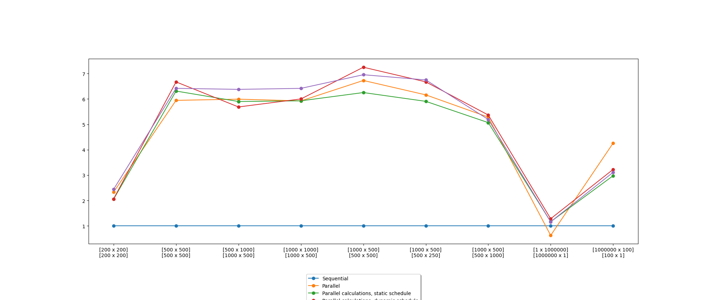

# Параллельное умножение матриц с помощью OpenMP

### Задача

Реализовать программу по вычислению произведения матриц с использованием
OpenMP. Исследовать эффективность распаралеливания и ускорения вычислений в
зависимости от способов распаралеливания.

### Технические характеристики 

Процессор: intel core i9-9900kf 3600МГц (8 ядер, 16 потоков)

### Последовательное решение
Последовательное решение представляет собой два вложенных цикла for, вычисляющие
каждый из элементов результирующей матрицы. Вычисление элемента результирующей матрицы - цикл, вычисляющий
сумму произведений соответствующих элементов исходных матриц. 

### Параллельные решения

##### Строка-задача
Параллелизация внешнего цикла for последовательного решения. Таким образом каждый поток будет получать в качестве
задачи строку матрицы.

##### Элемент-задача
Задачей становится вычисление значения элемента результирующей матрицы. Это увеличивает общее кол-во задач, но 
потенциально позволяет эффективнее распределять задачи между процессами. 

Типы распределения задач:
* static - поровну
* dynamic - батчами задач фиксированного размера
* guided - батчами задач меняющегося размера

Режимы dynamic и guided позволяют эффективнее балансировать нагрузку,
однако они проигрывают static в ситуациях, когда время на выполнение каждой задачи одинаково, таким образом распределение
задач по итогу совпадет со static. Поскольку static scheduling не привносит дополнительных расходов на 
распределение батчей по потокам в режиме реального времени, static окажется быстрее.

### График 
На графике показаны ускорения вычисления результата для различных параллельных
реализаций относительно последовательного решения. 
Параллельные реализации запускались в количестве потоков, автоматически установленных OpenMP. Выбирается оптимальное число
потоков по умолчанию (число логических ядер). Данный график получен при работе на 16 потоках  

### Вывод
В большинстве случаев, наиболее эффективными являются методы с guided и dynamic распределением задач, 
так как они позволяют более гибко распределять задания между потоками. Но static распределение, 
как и параллелизация строк, позволяют решить некоторые кейсы не хуже более гибких методов 
