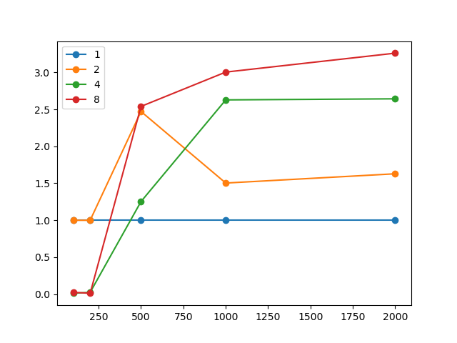

# Решение СЛАУ методом Якоби с помощью MPI

### Технические характеристики 

Процессор: intel core i9-9900kf 3600МГц (8 ядер, 16 потоков)

### Задача
СЛАУ представлена в матричной форме : `A[n×n] × x[n×1] = b[n×1]`.

Даны матрицы A и b, необходимо найти x с заданной точностью.

Реализовать алгоритм решения СЛАУ методом Якоби с использованием MPI.

### Параллельный алгоритм
1. Каждый из процессов получает параметры: 
    - N - размерность системы
    - A - строки матрицы A
    - b - элементы вектора свободных членов
    - x0 - начальное приближение
2. Нулевой процесс делит задачу на равные батчи, рассылает информацию о размере и сдвиге батча всем процессам.
2. На каждой итерации каждый из процессов вычисляет свою часть вектора x. Затем
он рассылает данную часть всем остальным процессам (синхронизация). После
выполнения данного шага все процессы будут иметь новую версию вектора x.
3. При достижении необходимой точности / превышении лимита итераций, выполнение завершается.

### Полученные результаты 
На графике отображено отсутвие какого-либо выигрыша по времени при размерах системы 100 и 250, но наблюдается 
повышение производительности при увеличении размера системы до 500, после чего параллельные алгоритмы дают выигрыш по 
времени в сравнении с последовательным алгоритмом.

### Вывод
Из полученных результатов можно сделать вывод, что параллельные алгоритмы не дают выигрыша при малых размерах 
системы. Но при работе с большим объемом данных, уже на 2 потоках получается заметное улучшение производительности.
 