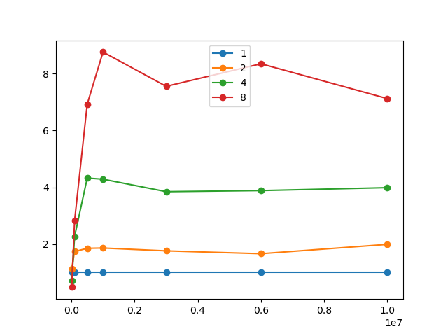
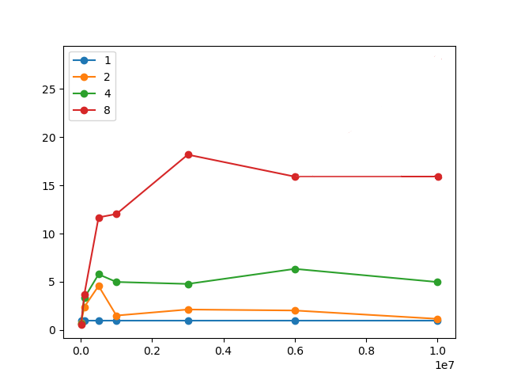
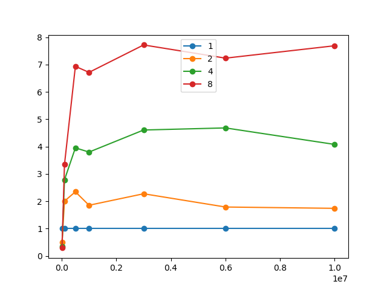

# Параллельная Быстрая сортировка (QUICK SORT) с использованием MPI

### Технические характеристики 

Процессор: intel core i9-9900kf 3600МГц (8 ядер, 16 потоков)

### Задача

Реализовать параллельный алгоритм Quicksort с использованием MPI, для сортировки числового массива.

#### Измерение времени вычисления

Важная часть алгоритма quicksort - выбор опорного элемента. Чем ближе этот элемент к медиане массива, тем быстрее
будет проходить сортировка. 

Вычисление медианы массива подразумевает сортировку массива, что смысла создание алгоритма как такового. 
Поэтому для улучшения эффективности рассчитывается не медиана всего массива, а, например медиана из первого, последнего и 
среднего элемента

Также можно использовать подмассив для определения опорного элемента.
Но в такой ситуации необходимо выбирать подмассив такой длины, чтобы медиана достаточно точно отражала 
распределение элементов в массиве, и при этом время время на его выборку и нахождение медианы не были слишком высокими.  

Были выбраны 3 способа выбора опорного элемента:
1. Первый элемент массива
2. Медиана первого, последнего и среднего
3. Медиана из подмассива

### Полученные результаты

На графиках показана зависимость ускорения (отношения времени выполнения сортировки,
использующей один процесс, ко времени выполнения сортировки, использующей несколько
процессов) от длины массива для разного количества процессов.

#### Опорный элемент — первый

#### Опорный элемент — медиана первого, последнего и среднего элемента

#### Опорный элемент — медиана подмассива 

Размер подмассива для графика - 50 элементов

## Вывод

Даже на большом числе итераций алгоритм с первым опорным элементов чаще всего показывает лучшие результаты чем алгоритм с 
нахождением медианы подмассива. Но при этом дает сильно менее стабильные результаты, так как снижает производительность 
на некоторых массивах. Поиск медианы подмассива в свою очередь всегда дает стабильное увеличение производительности, но 
не самое высокое. 

В связи с чем метод выбора опорного элемента зависит от задачи и при реализации параллельного алгоритма quicksort
нельзя точно указать наилучший метод.   