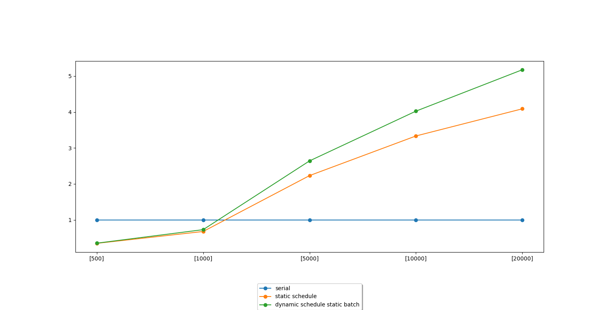

# Параллельный алгоритм Дейкстры с помощью OpenMP

### Технические характеристики 

Процессор: intel core i9-9900kf 3600МГц (8 ядер, 16 потоков)

### Задача

Реализовать параллельный алгоритм Дейкстры (Поиск минимального расстояния от вершины графа до всех остальных).

Алгоритм Дейкстры:

    1) Поиск ближайшей к текущему подграфу (начальная вершина) вершину 
    2) Добавление найденной вершины в подграф
    3) Релаксация расстояний от новой вершины до остальных
    

### Параллельное решение

Параллелизуются 2 этапа алгоритма: нахождение ближайшей вершины, релаксация расстояний. 

Сравнение реализовано для следующих типов алгоритмовв:
 
    1) последовательный 
    2) статическое планирование 
    3) динамическое планирование.

### Графики ускорения

График ускорения работы в зависимости от типа планирования и размера графа

## Вывод
Ожидаемо, что на малых размерах графа параллелизация не дает выигрыша в скорости. 

При увеличении размера графа можно наблюдать значительный выигрыш по скорости. Также можно говорить о том, что
на этой задаче динамическое планирование показывает себя лучше статического. 
